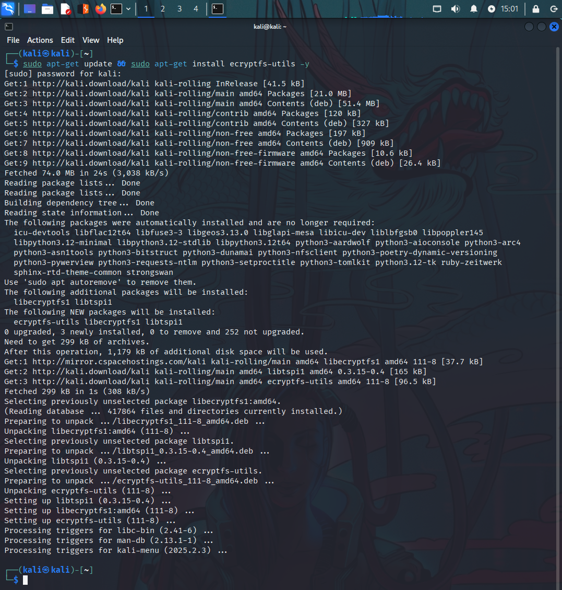
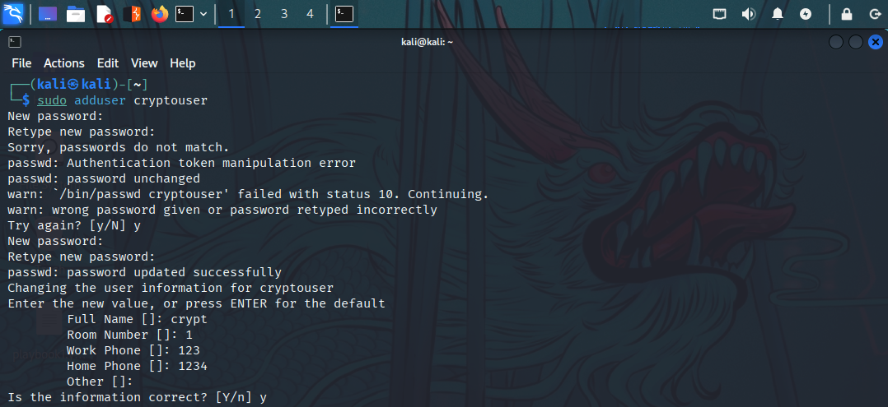
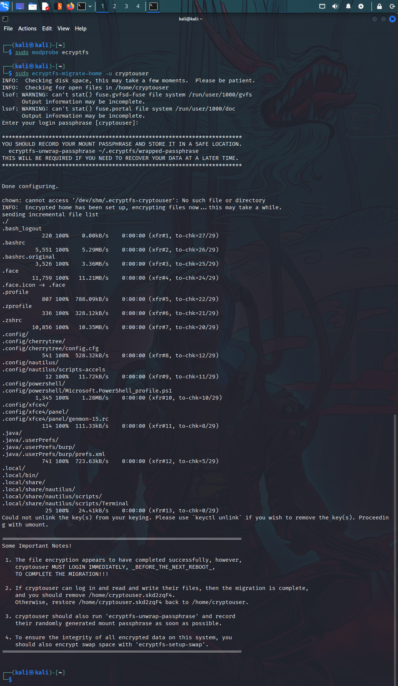
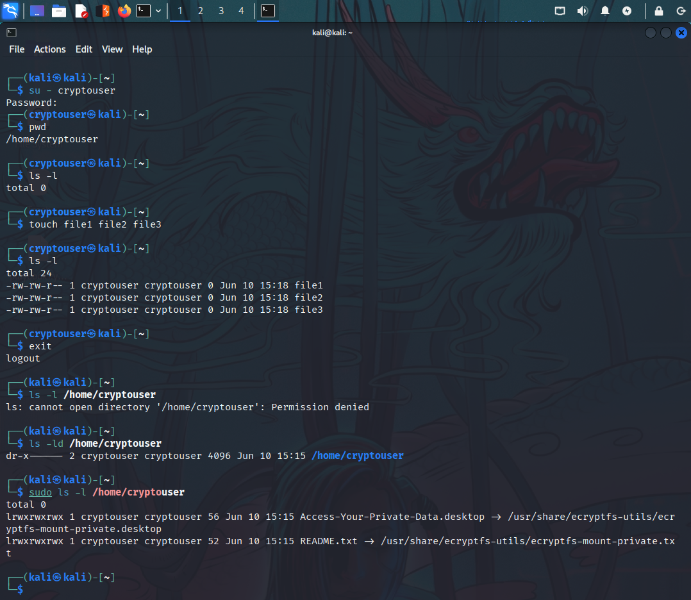
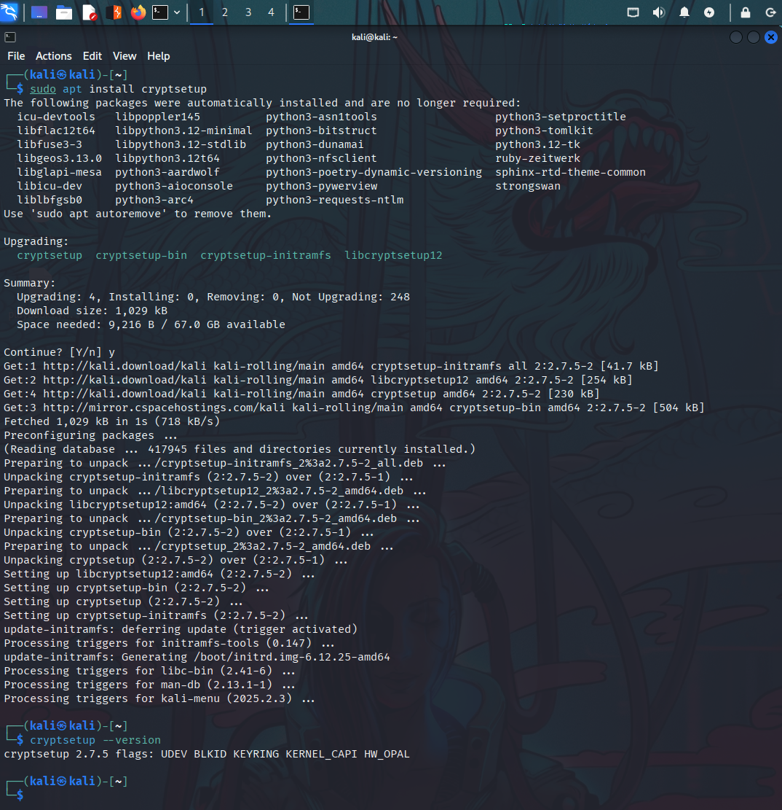
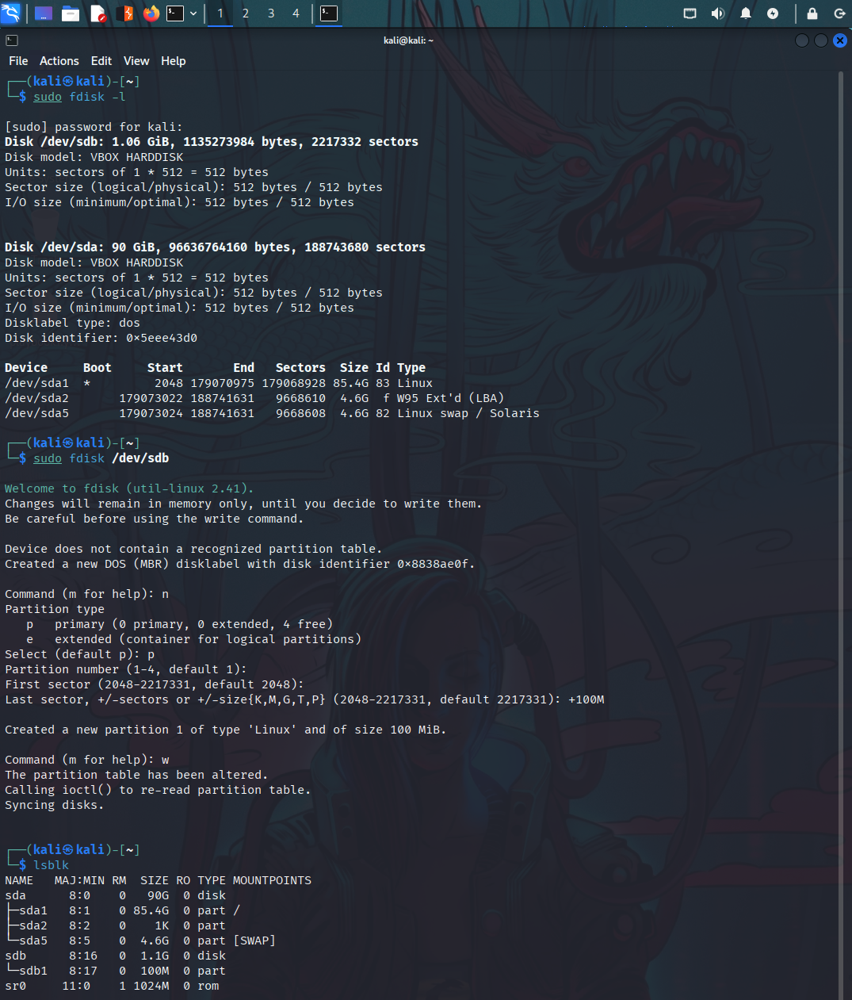
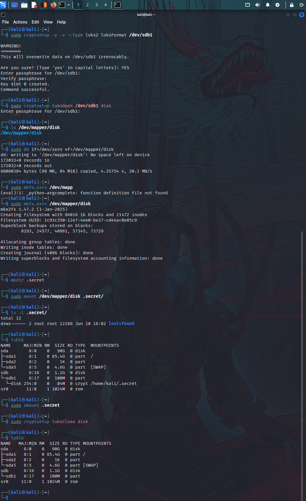

# Домашнее задание к занятию «Защита хоста»

## Задание 1

1. Установите eCryptfs.

2. Добавьте пользователя cryptouser.

3. Зашифруйте домашний каталог пользователя с помощью eCryptfs.

*В качестве ответа пришлите снимки экрана домашнего каталога пользователя с исходными и зашифрованными данными.*

### Решение

1. Установите eCryptfs.

    ```
    ┌──(kali㉿kali)-[~]
    └─$ sudo apt-get update && sudo apt-get install ecryptfs-utils -y
    ```

    

2. Добавьте пользователя cryptouser.

    ```
    ┌──(kali㉿kali)-[~]
    └─$ sudo adduser cryptouser
    ```

    

3. Зашифруйте домашний каталог пользователя с помощью eCryptfs.

    ```
    ┌──(kali㉿kali)-[~]
    └─$ sudo modprobe ecryptfs                  
                    
    ┌──(kali㉿kali)-[~]
    └─$ sudo ecryptfs-migrate-home -u cryptouser
    ```

    

**Проверка**



---

## Задание 2

1. Установите поддержку LUKS.

2. Создайте небольшой раздел, например, 100 Мб.

3. Зашифруйте созданный раздел с помощью LUKS.

*В качестве ответа пришлите снимки экрана с поэтапным выполнением задания.*

### Решение

1. Установите поддержку LUKS.

    ```
    ┌──(kali㉿kali)-[~]
    └─$ sudo apt install cryptsetup
    ```

    

2. Создайте небольшой раздел, например, 100 Мб.

    ```
    ┌──(kali㉿kali)-[~]
    └─$ sudo fdisk /dev/sdb
    ```

    

3. Зашифруйте созданный раздел с помощью LUKS. + проверка

    ```
    ┌──(kali㉿kali)-[~]
    └─$ sudo cryptsetup -y -v --type luks2 luksFormat /dev/sdb1

    ┌──(kali㉿kali)-[~]
    └─$ sudo cryptsetup luksOpen /dev/sdb1 disk

    ┌──(kali㉿kali)-[~]
    └─$ ls /dev/mapper/disk

    ┌──(kali㉿kali)-[~]
    └─$ sudo mkfs.ext4 /dev/mapper/disk

    ┌──(kali㉿kali)-[~]
    └─$ mkdir .secret

    ┌──(kali㉿kali)-[~]
    └─$ sudo mount /dev/mapper/disk .secret/

    ┌──(kali㉿kali)-[~]
    └─$ sudo umount .secret

    ┌──(kali㉿kali)-[~]
    └─$ sudo cryptsetup luksClose disk
    ```

    

---